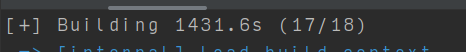

## BentoML exam
+ Name : Francois
+ Course : NOV24BDS MLE
+ [bentoml-exam](https://github.com/fdevi3-mle/bentoml-exam) 
+ branch : `francois-develop`

## DOCKERHUB pull
Pull the docker from the image(see picture) below
`fdevi3/ds-bentoml-exam` with the appropriate tag

### Exam Steps:
+ Create a Model to predict admission
+ Save Model to BentoML
+ Create a Bento Service that provides a prediction
+ Add a very naive layer of security via a jwt layer
+ Test out predictions for different admission score
+ Create a bunch of unit tests to test out service

## How to Start
+ Just in case `docker pull` doesnt work, Follow steps below,
+ FYI Zenml and Bentoml are 2 different things and if you don;t understand get some one who does.
+ Clone the repo and install the necessary requirements from `requirements.txt`.
+ The main entry point is `zenml-main.py` which contains a pipeline to do all the steps of ML.
+ Don't forget to download the input admission file from the `utils.py`
+ Once the pipeline is run the model is saved as `admission_model:xxxxxx` to the bento store. Use the `latest` to get the latest model
+ Start the bento service from `src` folder using the command provided in the DS Bentoml course (Don't forget to alter it according to the service name as seen as the decorator in the `service.py`)
+ Run the `test.py` for testing , one can use `good_data` to check for predictions
+ Run the `test_test.py` for all desired unit tests
+ Build the bento using the commands provided in the DS Bentoml Course
+ Containerize it via the commands from the course
+ Run it and test out via `test` again 

### Note
Note the zip file only contains the README.md. All the necessary files exist on my branch and github , see above
The reason , the building and zipping of docker takes too long(see image below, and its not even done) and file size is over 1.2 GB 
#####

The docker can be built for testing via the commands as presented in the DS BentoML course
